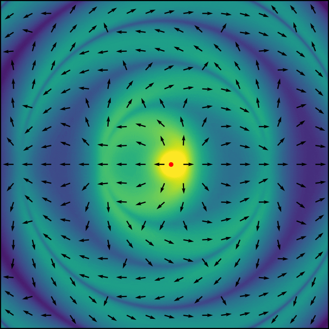

# PyCharge

> PyCharge is an open-source computational electrodynamics Python simulator that can calculate the electromagnetic fields and potentials generated by moving point charges and can self-consistently simulate dipoles modeled as Lorentz oscillators.


<div align="center">

[](https://github.com/MatthewFilipovich/pycharge/actions/workflows/build.yml)
[](https://codecov.io/gh/MatthewFilipovich/pycharge)
[](https://pycharge.readthedocs.io/en/latest/?badge=latest)
[](https://pypi.org/project/pycharge/)
[](https://www.python.org/downloads/)
[](https://github.com/MatthewFilipovich/pycharge/blob/main/LICENSE)

</div>

<p align="center">
  
</p>

PyCharge was developed to allow both novice and experienced users model a wide range of classical electrodynamics systems using point charges: the package can be used as a pedagogical tool for undergraduate and graduate-level EM theory courses to provide an intuitive understanding of the EM waves generated by moving point charges, and can also be used by researchers in the field of nano-optics to investigate the complex interactions of light in nanoscale environments.

# Key Features

- ⚡️ **Point Charge Electrodynamics:** Compute relativistically-correct electromagnetic potentials and fields generated by moving point charges.
- ⚛️ **Self-Consistent N-Body Electrodynamics:** Simulate the dynamics of electromagnetic sources—such as free charges and dipoles—interacting through their self-generated fields.
- 🔥 **Powered by JAX:** Leverage JAX's just-in-time (XLA) compilation for GPU/TPU acceleration, vectorization, and scalable parallel execution.
- 🛠️ **Fully Differentiable:** End-to-end differentiability enables gradient-based optimization, control, and inverse design workflows.

Learn more about PyCharge in our research paper published in [Computational Physics Communications](https://doi.org/10.1016/j.cpc.2022.108291) and includes an extensive review of the rich physics that govern the direct space-time modeling of mechanically dressed dipole-dipole interactions with electromagnetically coupled oscillating dipoles on [Physics Review A](https://journals.aps.org/pra/abstract/10.1103/bmm8-9pn6).

## Documentation

See the manual hosted at [pycharge.readthedocs.io](https://pycharge.readthedocs.io/) for the latest documentation.

## Installation

PyCharge and its dependencies can be installed using [pip](https://pypi.org/project/pycharge/):

```sh
pip install pycharge
```

To install in development mode, clone the GitHub repository and install with pip using the editable option:

```sh
git clone https://github.com/MatthewFilipovich/pycharge
pip install -e ./pycharge
```

## Usage

An overview of the classes and methods implemented in the PyCharge package is shown in the figure below:
<p align="center">
  
</p>

The electromagnetic fields and potentials generated by moving point charges can be calculated using PyCharge with only a few lines of code. The following script calculates the electric field components and scalar potential along a spatial grid in the x-y plane generated by two stationary charges:

```python
import pycharge as pc
from numpy import linspace, meshgrid
from scipy.constants import e
sources = (pc.StationaryCharge((10e-9, 0, 0), e),
           pc.StationaryCharge((-10e-9, 0, 0), -e))
simulation = pc.Simulation(sources)
coord = linspace(-50e-9, 50e-9, 1001)
x, y, z = meshgrid(coord, coord, 0, indexing='ij')
Ex, Ey, Ez = simulation.calculate_E(0, x, y, z)
V = simulation.calculate_V(0, x, y, z)
```

Two dipoles separated by 80 nm along the x-axis are simulated over 40,000 timesteps in the script below:

```python
import pycharge as pc
from numpy import pi
timesteps = 40000
dt = 1e-18
omega_0 = 100e12*2*pi
origins = ((0, 0, 0), (80e-9, 0, 0))
init_d = (0, 1e-9, 0)
sources = (pc.Dipole(omega_0, origins[0], init_d),
           pc.Dipole(omega_0, origins[1], init_d))
simulation = pc.Simulation(sources)
simulation.run(timesteps, dt, 's_dipoles.dat')
```

_For more examples and usage, please refer to the [documentation](https://pycharge.readthedocs.io/)._

## Contributing

We welcome all bug reports and suggestions for future features and enhancements, which can be filed as GitHub issues. To contribute a feature:

1. Fork it (<https://github.com/MatthewFilipovich/pycharge/fork>)
2. Create your feature branch (`git checkout -b feature/fooBar`)
3. Commit your changes (`git commit -am 'Add some fooBar'`)
4. Push to the branch (`git push origin feature/fooBar`)
5. Submit a Pull Request

## Citing PyCharge

If you are using PyCharge for research purposes, we kindly request that you cite the following paper:

M. Filipovich and S. Hughes, [PyCharge: An open-source Python package for self-consistent electrodynamics
simulations of Lorentz oscillators and moving point charges](https://arxiv.org/abs/2107.12437), arXiv:2107.12437.

## License

PyCharge is distributed under the GNU GPLv3. See [LICENSE](https://github.com/MatthewFilipovich/pycharge/blob/master/LICENSE) for more information.

## Acknowledgements

PyCharge was written as part of a graduate research project at [Queen's University](https://www.queensu.ca/physics/home) (Kingston, Canada) by Matthew Filipovich and supervised by [Stephen Hughes](https://www.physics.queensu.ca/facultysites/hughes/).
